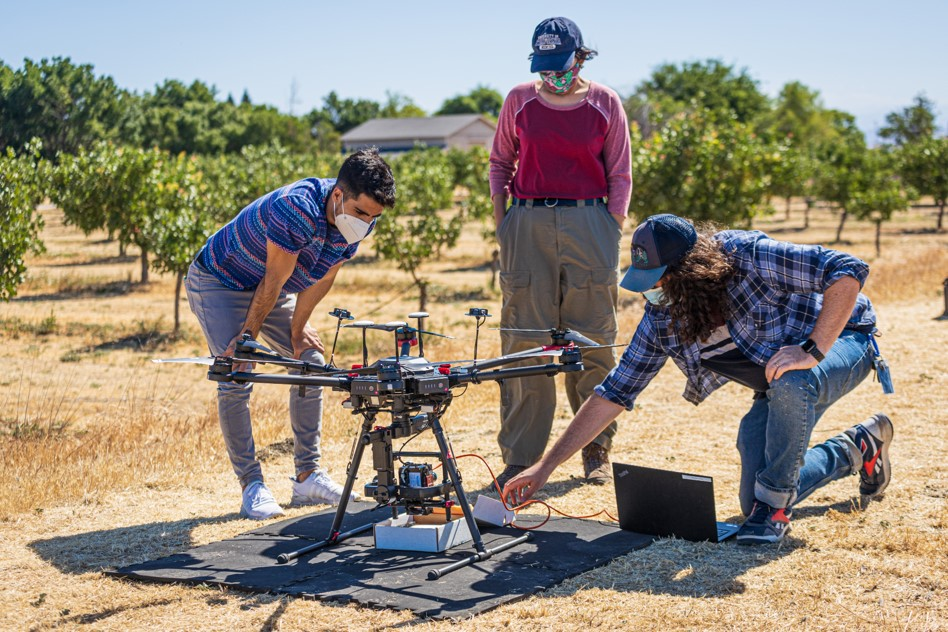
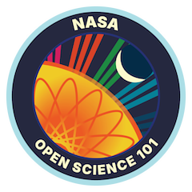

  

Jacob Nesslage 
======

---
## About Me
I’m a Ph.D. Candidate in the Environmental Systems Graduate Group at the University of California, Merced. I conduct research in the Earth Observation and Remote Sensing (EORS) Lab (PI: Dr. Erin Hestir). My work sits at the intersection of remote sensing, ecology, and open science. When I'm not coding, collecting field data, or engaging in science, you can find me hiking, swimming, reading, or playing guitar.

## Research Focus

### Biodiversity at the Terrestrial-Aquatic Interface
My dissertation research leverages multi-scale remote sensing — from satellites, drones, and aircraft — combined with in-situ biodiversity surveys and environmental DNA (eDNA) from soils, sediments, and water. Together, these datasets help me assess, monitor, and model biodiversity across dynamic terrestrial–aquatic interfaces. I am especially interested in how hydrology and geomorphology shape biodiversity and ecosystem services, focusing on floodplains, river corridors, and ephemeral wetlands — the transitional zones where life and water converge.

    
  </a>

### Spatiotemporal Data Fusion
A growing area of my research involves spatiotemporal data fusion, particularly for combining satellite and UAV imagery to generate synthetic fine-resolution time series. These approaches have applications in precision agriculture, environmental monitoring, and other domains where high spatial and temporal resolution are essential.

    
  </a>

### Open Science and Tools

I’m a strong advocate for open-source geospatial science, reproducible workflows, and transparent methods. Much of my work centers on building modular tools for QGIS, Python, and R — including **OpenRES**, an open-source QGIS plugin for automated hydrogeomorphic feature extraction.

  

  
  
  
  
  

---

<table>
  <tr>
    <td>

 
    </td>
    <td>

    </td>
  </tr>
</table>
